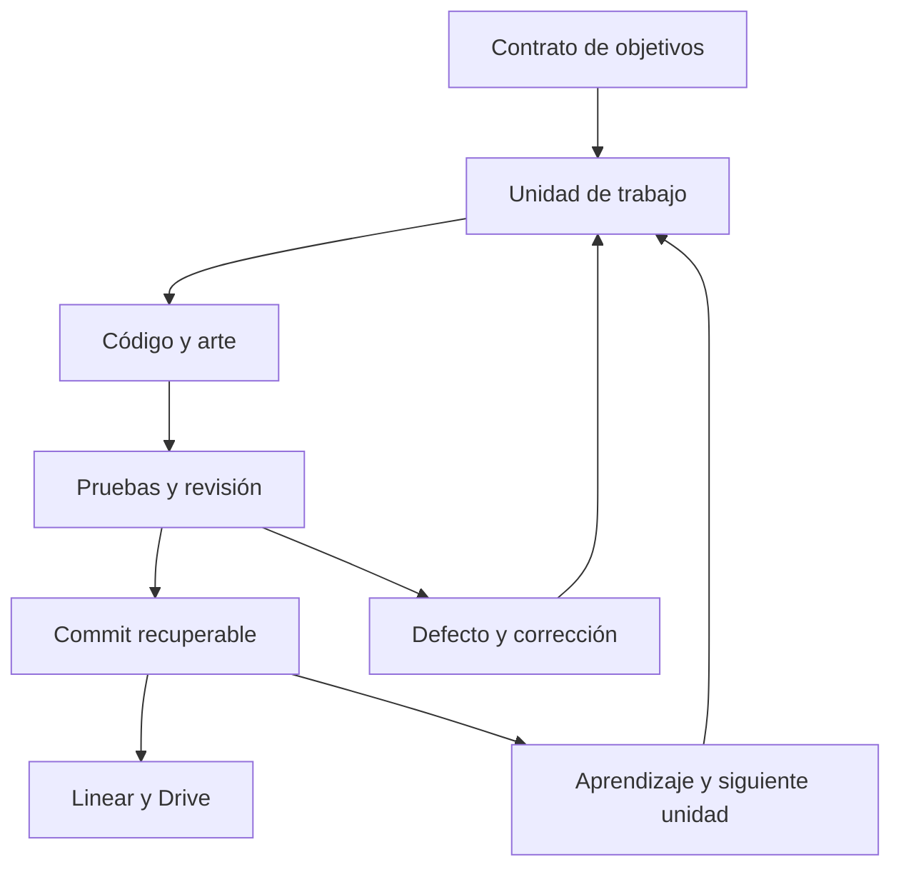

# Arquitectura EXOVANT 2950

## Autoridad y proyecciones
GitHub `rotprods/-` contiene fuentes, diseño, assets editables, tests y estado. `_project_intelligence/STATE.json` es el estado canónico; los Markdown son vistas legibles. `graph.json` enlaza hechos, decisiones, artefactos, pruebas y fronteras. No es una segunda base de verdad. Linear organiza unidades de trabajo y Drive conserva un dossier y snapshots identificados. Mem ofrece recuperación por conceptos y enlaces. Los MCP de estudio pertenecen a `rotprods/game-dev-mcp-hub`; no se copian sus submódulos al videojuego.

## Runtime actual
`scenes/main.tscn` carga `scripts/world.gd`. World construye Terra y coordina interacciones, NPC, puzzle, enemigos y HUD. Player controla cámara, desplazamiento, stamina, bloqueo, ataques, curación y vehículo básico. Enemy implementa estados de ataque/recuperación y visibilidad física. Progress es la autoridad de misiones/recompensas. SaveStore serializa un sobre versionado con digest, escritura temporal y generación de respaldo. Este guardado es de un proceso; no es base de datos concurrente.

La primera frontera de modularización es extraer datos de encuentros, objetivos y diálogo del World cuando se amplíe EXO-005/009. No trasladar los doce mundos a un único script gigante. Separar dominio persistente de presentación antes de viajes planetarios. Identificadores estables del catálogo sobreviven cambios de escena y motor.

## Pipeline de arte
`art_source/reliquary_gate` conserva Blender, generadores y validación. `assets/reliquary_gate.glb` es el intercambio actual con Godot. Se eliminan nodos de presentación en runtime y se añade colisión jugable; eso debe evolucionar a un export de producción con colisión separada, pivotes, escala, UV, texturas, LOD y presupuesto medido. Blender remoto no equivale a Unreal remoto. Mantener GLB como intercambio y .blend como fuente.

## Cuatro planos COS / CGVE2
Authority: instrucciones vigentes + AGENTS + STATE + fuentes.
Projection/context: MEMORY, PROGRESS, HANDOFF, graph y superficies externas.
Execution: unidades EXO, herramientas disponibles, código, assets y builds.
Assurance: Gauntlet, hash de fuentes, tests adversariales, recibos, aprendizaje y recuperación en frío.

El grafo se actualiza tras cambios significativos y se verifica en cada cierre. No hay observador universal de aplicaciones ni grafo 24/7: la actualización sucede dentro de las ejecuciones reales. JSON versionado es suficiente hoy; no se instala una base de grafos.

## Producción y motor
Godot 4.7.2 es el prototipo ejecutable. Unreal 5.8 sigue como candidato de producción, sujeto a EXO-012: misma escena representativa, controles, geometría, materiales, tiempos CPU/GPU, memoria, carga y export. La migración no se decide por marketing o por tener un conector. Ni DLSS ni el aumento de polígonos resuelven diseño de combate, animación o composición.

## Control ejecutable de producción

PLAN.json enlaza North Star → objetivos → fases → unidades → gates. studio.py valida IDs, cobertura, ciclos, escritor y recibos antes del cierre. La reserva es local y el guardado remoto usa un padre verificado; no se afirma un lock distribuido. Las pruebas e inputs actuales se atan a source_digest. Graphify se regenera desde PLAN, catálogo y aprendizaje; project_control comprueba divergencia.

## Entrada y preferencias

controls.gd administra un mapa validado de acciones: escritorio y mando independientes, sticks con zona muerta, navegación UI separada, Escape/Start reservados. JSON local versionado y escritura temporal antes de renombrar; error de escritura conserva el mapa vigente y corrupción recupera defaults. world.gd captura remapeo/pausa antes de GUI; player.gd usa acciones de juego y frena simulación durante modales. tests/test_input.gd entra por Input.parse_input_event, ejecuta física y serialización reales y se integra en CI. No hay controlador físico cualificado; ejes/sensibilidad/inversión todavía no son configurables.

## EXO-006-ART-001 · isolated art checkpoint, 12 September 2026
User assigned this agent to remote Blender; gameplay stays with the parallel agent. Branch art/terra-reliquary-kit-001 and PR #1 reserve art_source. External agent acknowledgment has not been observed. Do not replace newer main STATE/PLAN with this branch snapshot blindly.

Original campaign catalog: 318 rows covered, 12 art directions, 21 category contracts, 28 Terra module briefs, all planned. Actual candidate: remote project710b21ea-a09a-4f3c-b3a4-ca446ec58bc8 revision4, editable .blend/GLB, 11 assembly roots, 12 embedded maps, 11 collision sources. Source/art evidence lives in art_source/terra_reliquary_kit/delivery.json and README.md. No runtime scripts/scenes or existing portal changed. Native import/PBR/UV and floor collision probe pass; normal Gauntlet still passes. Renders inspected; no human AAA or GPU gate is claimed.

Failures retained: first render exceeded300000ms, missing presentation UV corrected, close-up faceting corrected, podium contact corrected. Isolated Godot visual capture is blocked by Xvfb listener/display; headless engine works. Telemetry is partial. Mem queue retained without another retry.

Gameplay handoff: EXO-004-ROUTE-002 experimental input driver reached Ines then failed at custodian_0; unclassified cause, not a confirmed gameplay regression. Disabled experiment and world.patch are archived in art_source/coordination. Next gameplay owner investigates route independently.

Next art unit: inspect this candidate with the actual camera on a working display, resolve interaction clearance/texel density/LOD transition and localized wear before expanding the 28-module kit or producing character final topology. The complete twelve-world campaign remains open.
