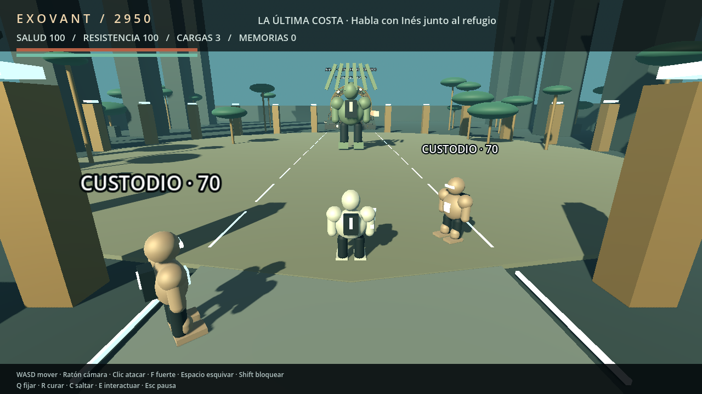

# EXOVANT 2950 · Humanity game

Universo 3D soulslike original: humanidad colonizadora en 2950. Este repositorio contiene el prototipo nativo Godot, fuentes de arte Blender, plan global y controles de continuidad. **En desarrollo: no es todavía el videojuego AAA completo.**



- [Reanudar el proyecto](HANDOFF.md) · [Contrato de agentes](AGENTS.md)
- [Estado verificable](_project_intelligence/STATE.json) · [Progreso](PROGRESS.md)
- [Objetivos](GOALS.md) · [Fases y calendario](ROADMAP.md) · [Protocolo de desarrollo](docs/DEVELOPMENT_PROTOCOL.md)
- [Arquitectura](ARCHITECTURE.md) · [Memoria y aprendizajes](MEMORY.md)
- [Biblia de los 12 mundos](design/EXOVANT_BIBLIA.md) · [Catálogo](design/EXOVANT_DATA.json)
- [Arte y calidad](docs/ART_PRODUCTION.md) · [Hardware y Unreal](docs/HARDWARE.md)
- [Grafo](_project_intelligence/graph.json) · [Backlog](_project_intelligence/BACKLOG.md)

## Ejecutar

Abrir project.godot con Godot 4.7.2 o seguir [RECOVERY](docs/RECOVERY.md). El motor no se distribuye dentro del repositorio; la descarga oficial y sus hashes están fijados en tools/engine.lock.json.

```sh
python3 tools/bootstrap_godot.py --destination .tools
.tools/Godot_v4.7.2-stable_linux.x86_64 --path .
```

WASD: movimiento · ratón: cámara · Q: fijar · clic: ataque ligero · F: fuerte · Shift: guardia · Espacio: esquiva · R: cura · C: salto · E: interactuar · Escape: pausa.

Mando: stick izquierdo mueve, derecho orienta cámara; RB/R1 ataca, Y/Triángulo golpe fuerte, LB/L1 guardia, B/Círculo esquiva, X/Cuadrado cura, A/Cruz interactúa, L3 salta, R3 fija y Start pausa. Cruceta y A/Cruz navegan los menús.

**Controles** permite remapear teclado, botones de ratón y botones de mando. Las teclas ocupadas se rechazan; los botones de mando ocupados intercambian acciones. Las preferencias se guardan aparte de la campaña; Escape/Start y la navegación de menús permanecen disponibles. El HUD muestra la asignación vigente.

## Comprobar

```sh
python3 -m unittest discover -s tests -p 'test_*.py'
python3 tools/project_control.py check
python3 tests/run_gauntlet.py --godot .tools/Godot_v4.7.2-stable_linux.x86_64
```

Los gates cubren importación, estado/guardado, escena nativa, entrada/preferencias y smoke. La integración prepara situaciones controladas; no sustituye una partida humana completa ni un perfil GPU. Los checks de continuidad rechazan eventos alterados, referencias rotas y pruebas ligadas a otras fuentes.

El plan propone 12 mundos, 84 misiones, 24 armas, 10 vehículos y 318 filas de assets. Son objetivos de producción; el prototipo implementa una cadena condensada de Terra. Siguiente incremento: EXO-004, ruta completa y usabilidad. Ver RIGHTS.md para procedencia y distribución.
